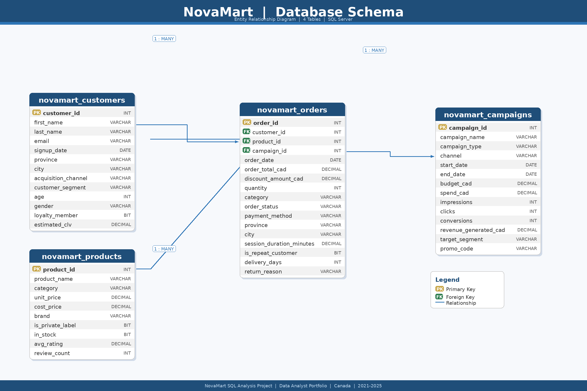
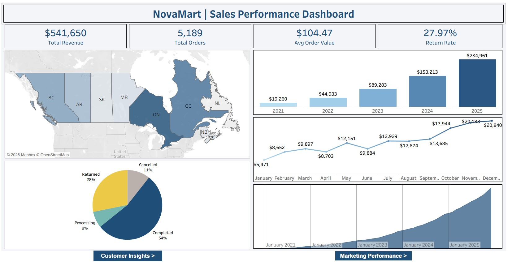
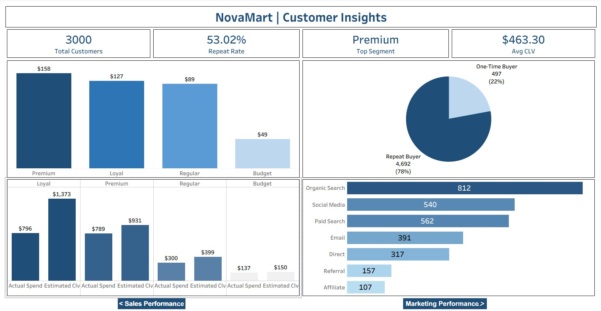
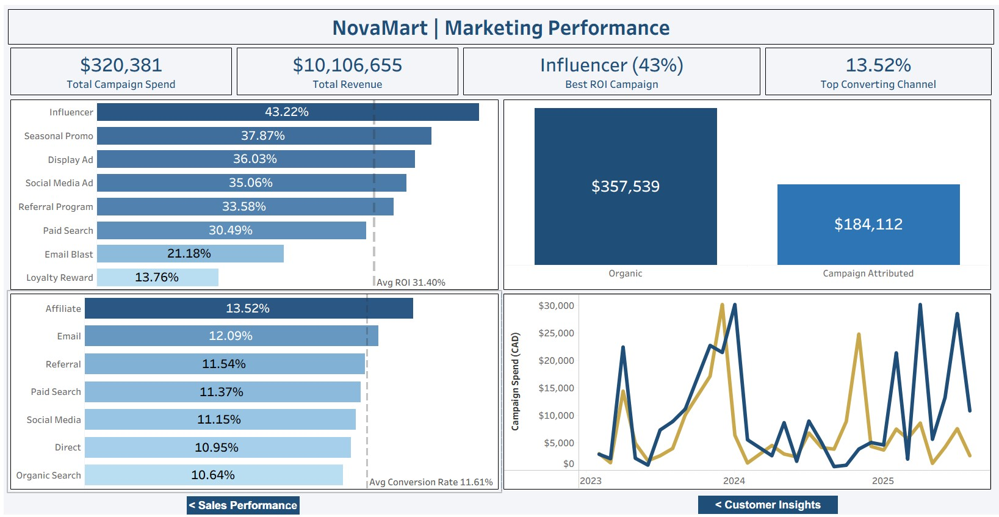

# NovaMart Retail Analysis
### End-to-End Data Analytics Project | SQL Server · Excel · Tableau

[](https://www.microsoft.com/en-ca/sql-server)
[](https://www.microsoft.com/en-ca/microsoft-365/excel)
[](https://public.tableau.com/app/profile/marcus.jacob/viz/NovamartDashboard/Dashboard3)

---

## 📊 Live Dashboard

🔗 **[View Interactive Tableau Dashboard](https://public.tableau.com/app/profile/marcus.jacob/viz/NovamartDashboard/Dashboard3)**

🔗 **[View Portfolio](https://marcus-jacob.my.canva.site/data-portfolio)**

---

## Business Scenario

NovaMart is a fictional Canadian e-commerce and general retail company founded in 2021, headquartered in Toronto, Ontario. Modeled after the convenience of Amazon and the everyday value of Walmart, NovaMart sells across eight product categories including Groceries, Electronics, Clothing, Household essentials, Health & Beauty, Sports & Outdoors, Toys & Games, and Office Supplies.

NovaMart ships to customers across all Canadian provinces, operates a loyalty membership program, and runs paid marketing campaigns across multiple digital channels including email, social media, paid search, and affiliate partnerships.

By late 2025, the company has grown to over 3,000 registered customers, 10,000+ orders, and 80 marketing campaigns. The leadership team is preparing for their 2026 strategic planning cycle and has brought in a junior data analyst to answer key business questions.

**That analyst is me.**

---

## My Role

As a Junior Data Analyst on the Customer Insights and Growth team, I was tasked with performing a full analysis of NovaMart's sales, customer, and marketing data to support executive decision-making heading into 2026.

---

## Tools and Skills Used

| Tool | Purpose |
|---|---|
| SQL Server (SSMS) | Data cleaning, EDA, segmentation, advanced analytics |
| Excel | Result set formatting and data validation |
| Tableau | Interactive dashboard and data visualization |

**SQL Concepts Demonstrated:**
- Data auditing and quality assessment
- Data cleaning with SELECT INTO and CASE WHEN
- Window functions: ROW_NUMBER(), LAG(), SUM() OVER(), NTILE(), DENSE_RANK()
- Common Table Expressions (CTEs) -- single and chained
- Level of Detail (LOD) expressions
- RFM customer scoring
- Cohort retention analysis
- Month over month growth analysis
- Running cumulative totals

---

## Database Schema



---

## Dataset

| Table | Rows | Description |
|---|---|---|
| novamart_customers | 3,000 | Customer demographics, segments, acquisition channels |
| novamart_orders | 10,000 | Orders spanning 2021 to 2025 across all provinces |
| novamart_products | 300 | Products across 8 categories with pricing and ratings |
| novamart_campaigns | 80 | Marketing campaigns with spend, impressions, and revenue |

**Date Range:** January 2021 to December 2025
**Geography:** Canada (all provinces)
**Currency:** Canadian Dollar (CAD)

> Note: This is a synthetic dataset generated specifically for this project. All company names, customer names, and values are fictional.

---

## Data Quality Findings

Before any analysis, a full data audit was conducted across all four tables. The following issues were identified and resolved in the cleaning phase.

| Table | Issue | Rows Affected | Action Taken |
|---|---|---|---|
| novamart_orders | No campaign attribution | ~6,500 orders | Retained, flagged as Organic |
| novamart_customers | Duplicate name combinations | ~60 rows | Deduplicated |
| novamart_orders | Duplicate order rows | ~250 rows | Deduplicated |
| novamart_orders | Discount exceeds order total | Multiple rows | Removed in clean table |
| novamart_orders | Zero or negative order totals | ~183 rows | Removed in clean table |
| novamart_orders | Extreme outlier totals above $5,000 | ~50 rows | Removed in clean table |
| novamart_customers | Impossible age values (0, -1, 999) | ~46 rows | Set to NULL |
| novamart_customers | Negative estimated CLV | ~31 rows | Set to NULL |
| novamart_campaigns | Spend exceeds budget | 4 campaigns | Flagged with is_overspent column |
| All tables | Inconsistent text formatting | Multiple columns | Standardized with CASE WHEN |

**Cleaning approach:** Raw tables were preserved unchanged. Four new clean tables were created using SELECT INTO with all transformations applied inline, maintaining a complete audit trail from raw to clean data.

---

## Project Structure

```
NovaMart-Retail-Analysis/
│
├── README.md
│
├── data/
│   ├── raw/                          # Original dirty CSV files
│   └── clean/                        # Exported clean CSV files
│
├── sql/
│   ├── 01_audit.sql                  # 7 data quality audit queries
│   ├── 02_cleaning.sql               # 4 cleaning scripts (raw to clean tables)
│   ├── 03_eda.sql                    # Section 2: Exploratory Data Analysis
│   ├── 04_segmentation.sql           # Section 3: Customer Segmentation and CLV
│   ├── 05_marketing.sql              # Section 4: Marketing and Funnel Performance
│   └── 06_advanced_analysis.sql      # Section 5: Advanced Analytics
│
├── tableau/
│   └── novamart_dashboard.twbx       # Tableau workbook (all 3 dashboards)
│
└── docs/
    ├── novamart_schema.png            # Database schema diagram
    └── novamart_business_questions.docx  # Full project brief
```

---

## Dashboard Preview

### Dashboard 1 -- Sales Performance


### Dashboard 2 -- Customer Insights


### Dashboard 3 -- Marketing Performance


🔗 **[Explore the live interactive dashboard here](https://public.tableau.com/app/profile/marcus.jacob/viz/NovamartDashboard/Dashboard3)**

---

## Executive Summary -- Key Findings

### Revenue and Growth
- NovaMart achieved **12x revenue growth** from 2021 to 2025, growing from $19,260 to $234,961 in annual completed order revenue, driven primarily by a 15x increase in order volume
- Average order value has **declined steadily** from $125.89 in 2021 to $100.41 in 2025, signalling a shift toward budget-conscious customers as the business scales
- NovaMart's revenue volatility has decreased significantly from 2021 to 2025, reflecting a maturing business with increasingly predictable seasonal patterns

### Seasonality
- Q4 accounts for approximately **58% of annual revenue**, with November and December being the strongest months every year
- **January is consistently the weakest month**, dropping between 41% and 71% from December every single year -- a predictable and addressable revenue gap that a targeted reactivation campaign could partially close

### Order Health
- NovaMart's **return rate of 27.97%** significantly exceeds industry benchmarks of 10% to 20% and is the single most urgent operational issue identified
- Combined with a 10.9% cancellation rate, **only 53% of orders complete successfully**, meaning nearly half of all transactions fail to generate recognized revenue

### Customer Segments
- **Loyal customers are NovaMart's most strategically valuable segment** despite not having the highest AOV, driven by a 48% higher purchase frequency than Premium customers
- **Nearly half of all customers (46.98%) never return** after their first purchase, representing a significant retention opportunity and a meaningful acquisition investment that is not converting to long-term value
- Regular customers are the silent revenue engine, collectively matching the Loyal segment revenue while representing the largest share of the customer base

### Lifetime Value
- **Every customer segment is underperforming against estimated CLV** -- Premium customers are realizing only 41% of their predicted lifetime value
- The Loyal segment's large CLV gap reflects untapped long-term potential rather than failure -- these customers have the highest long-term revenue opportunity if retention programmes are strengthened

### Geography
- **Ontario and Quebec generate 59.6% of total revenue**, creating geographic concentration risk that warrants a deliberate regional diversification strategy
- **British Columbia has the highest AOV** among major provinces at $109.24, suggesting a premium customer mix that could respond well to higher-margin product offerings
- **New Brunswick shows the highest AOV of all provinces** at $132.32 despite low order volume, flagging it as a potential high-value niche market worth further investigation

### Marketing Performance
- **Organic orders account for 66% of total revenue**, reflecting a strong returning customer base that is NovaMart's most valuable and cost-efficient revenue stream
- **Affiliate is the highest converting paid channel** at 13.52% conversion rate, significantly above the 11.61% average
- **Email delivers the best efficiency** among paid channels, achieving high conversion rates with moderate spend
- **Referral is significantly underleveraged** -- it has the lowest CTR but strong conversion quality, suggesting a formal referral programme could unlock significant high-quality traffic
- **Influencer campaigns deliver the highest ROI** at 43.22%, well above the 31.40% average across all campaign types

---

## SQL Highlights

### RFM Customer Scoring (Q26)
Scored all customers across Recency, Frequency, and Monetary dimensions using NTILE(4) window functions, combining three chained CTEs to produce a composite RFM score for every customer.

### Month over Month Revenue Growth (Q24)
Used LAG() window function to calculate percentage change in revenue between consecutive months across all five years, identifying consistent seasonal patterns and growth acceleration.

### Customer Cohort Retention (Q28)
Used DATEDIFF() and conditional aggregation to track what percentage of each signup year cohort made their first purchase within 90 days, producing actionable retention benchmarks by cohort.

### Top 3 Products per Category (Q29)
Applied DENSE_RANK() OVER(PARTITION BY category) to rank products within each category and filtered to the top 3, solving a classic ranked-within-group problem common in retail analytics.

---

*NovaMart is a fictional company created for portfolio purposes. All data is synthetic.*
